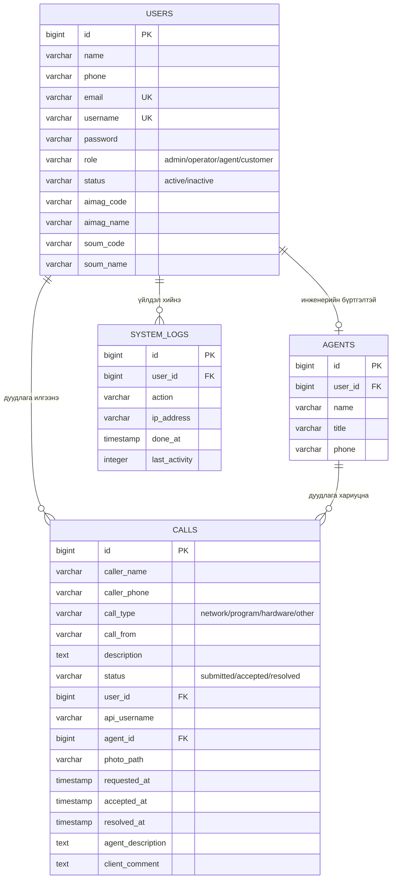

# Дуудлага бүртгэлийн системийн өгөгдлийн сангийн диаграмм

Энэ диаграммыг тайлангийн “Өгөгдлийн сангийн диаграмм” хэсэгт ашиглана. Mermaid дэмждэг редактор эсвэл https://mermaid.live дээр доорх кодыг оруулж зураг болгон экспортолж болно.



## Хүснэгтүүдийн зорилго

| Хүснэгт | Зорилго |
|---|---|
| `users` | Харилцагч, оператор, инженер, хэлтсийн дарга/админы нэвтрэх болон үндсэн мэдээлэл. |
| `agents` | Инженерийн ажлын мэдээлэл; `users.id`-тай `user_id` талбараар холбогдоно. |
| `calls` | Дуудлага, төлөв, тайлбар, хариуцсан инженер, огноо, сэтгэгдэл. |
| `system_logs` | Хэрэглэгчийн хийсэн үйлдлийн аудит лог. |

## Хэлтсийн дарга / админ

Админ нь `users.role = admin` эрхтэй хэрэглэгч. Туршилтын бүртгэл:

```text
Нэвтрэх нэр: admin
Нууц үг: password123
Нэр: Хэлтсийн дарга (Админ)
```

Админ бүх дуудлагыг харах, шүүх, тайлан харах, хэрэглэгч/инженер нэмэх, хэрэглэгчийг идэвхгүй болгох, системийн логийг харах эрхтэй.
